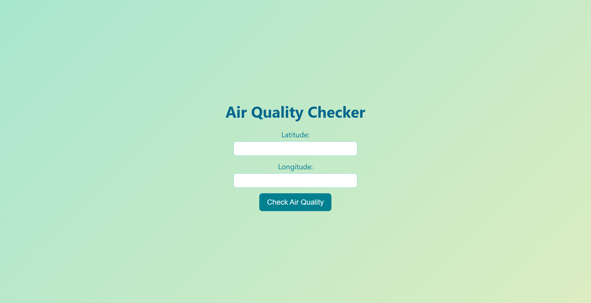
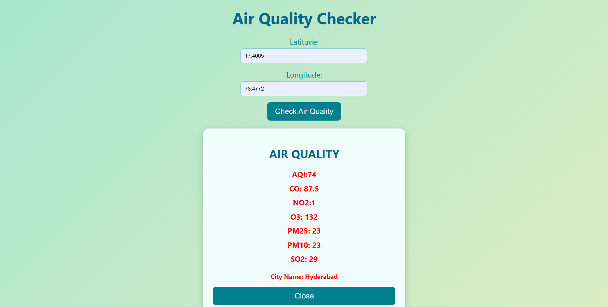

# Air Quality Checker

This project is a simple web application that allows users to check the air quality based on their geographical coordinates (latitude and longitude). The app fetches real-time air quality data from the **RapidAPI** Air Quality API and displays the air quality index (AQI) to help users understand the air quality in their area.

## Features

- Enter latitude and longitude to get air quality information.
- Displays air quality data, including AQI, pollutants, and other details.
- User-friendly interface built using **HTML**, **CSS**, and **JavaScript**.
- Fetches real-time data using the **RapidAPI** Air Quality API.

## Technologies Used

- **HTML** - Structure of the website
- **CSS** - Styling the user interface
- **JavaScript** - Fetches data from the API and handles user interaction
- **RapidAPI** - Provides the air quality data

## How to Use

1. **Enter Coordinates**: Input your **Latitude** and **Longitude** in the provided fields.
2. **Check Air Quality**: After entering the coordinates, click the "Check Air Quality" button.
3. **View Results**: The air quality data, including the AQI and related information, will be displayed on the page.

## How to Run Locally

1. Clone this repository to your local machine:
   ```bash
   git clone https://github.com/shivadhanush1216/Air-Quality-Checker.git

2. Navigate to the project folder:
    cd Air-Quality-Checker

3.Open index.html in your browser:

Simply double-click the index.html file or open it via a browser.

## API Integration

This app uses the Air Quality API from RapidAPI to fetch real-time data based on the user's coordinates. You can sign up on RapidAPI and get your API key.

To replace the API key:
Go to RapidAPI - Air Quality API.
Sign up or log in to your RapidAPI account.
Subscribe to the Air Quality API.
Replace the API key in the JavaScript file to make the API call work.

## Screenshots




Live Demo
You can also view the live demo of this project here:
https://air-quality-checker-gilt.vercel.app/
